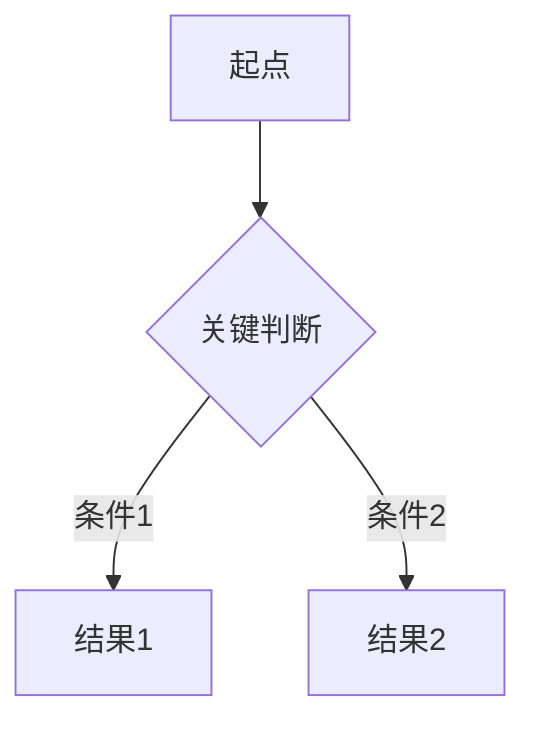

# Product Requirements Skill

## Purpose

Turn scattered product intent into a concise PRD that an agile team can align on quickly. The goal is enough shared clarity to plan, build, test, and accept the work, not a maximal document.

Use this skill when the user asks to:

- create or refine a PRD / 产品需求文档
- turn notes, meeting outcomes, screenshots, or docs into requirements
- adapt a demand submission template into an agile PRD
- clarify MVP scope, acceptance criteria, dependencies, or risks
- reduce an overly detailed PRD into a team-readable version

## Operating Principles

- **Core sections must not be missing.** Keep the required PRD spine: metadata, background/value, user scenarios, flow, core features with AC, non-product items, dependencies/risks, acceptance/release.
- **Prefer concise alignment over exhaustive explanation.** Each section should answer the team's next planning question. Avoid long prose, broad theory, and redundant tables.
- **Make uncertainty visible.** If information is missing, write `待确认` with the exact owner/question instead of inventing detail or blocking the whole PRD.
- **Separate product intent from implementation ownership.** Product writes the user outcome and acceptance standard; technical implementation notes can be brief and marked for tech confirmation.
- **Do not force process artifacts.** Story Points, sprint task decomposition, detailed DoD, risk matrices, and full persona sheets are optional. Include them only when the user provides them or explicitly asks.

## Interaction Process

### Step 1: Gather Context

First understand the project and available source material.

Actions:
1. If working inside a repo, skim README, package metadata, docs, and relevant existing requirements before asking questions.
2. If the user provides a document/template/link, read it first and extract the reusable structure.
3. Summarize the requirement in one sentence:
   `我的理解是：这个需求要为 [用户/角色] 解决 [问题]，通过 [核心能力] 达成 [业务结果]。`
4. If the brief is thin, ask at most 3 high-leverage questions before drafting.

High-leverage questions:
- 这个需求的业务痛点和预期价值是什么？最好有一个可量化目标。
- MVP 里必须交付什么？哪些可以后置？
- UI/交互是否有截图、线稿、竞品或现有组件参考？

### Step 2: Readiness Check

Use a lightweight readiness status instead of a numerical scoring gate.

```markdown
需求就绪度: Ready / Needs Alignment / Blocked

- 背景价值: 清晰 / 待确认 [缺什么]
- 用户场景: 清晰 / 待确认 [缺什么]
- MVP范围: 清晰 / 待确认 [缺什么]
- 功能AC: 清晰 / 待确认 [缺什么]
- 依赖风险: 清晰 / 待确认 [缺什么]
```

Status guidance:
- **Ready**: core user path, MVP scope, and AC are clear enough for sprint planning.
- **Needs Alignment**: can draft PRD, but mark 1-5 open questions.
- **Blocked**: critical decision is missing, such as target user, launch deadline, or must-have scope. Ask the minimum questions needed.

Do not wait for perfect information. Draft with explicit assumptions when the team would benefit from a concrete artifact.

### Step 3: Draft the PRD

Default output path: `docs/{feature-name}-prd.md`.

If there is no repo or `docs/` directory, create a clear Markdown file in the current workspace. Use Chinese by default, with common agile terms left in English where useful: MVP, AC, Sprint, DoD.

Length discipline:
- Start with a one-screen alignment summary.
- Prefer compact tables over paragraphs.
- Limit each feature to 2-4 acceptance criteria.
- Keep background/value to one table plus success metrics.
- Keep risks to the few that can change scope, timeline, quality, or launch.
- Put deep implementation detail, research notes, or long alternatives in an appendix only if requested.

### Step 4: Review With the User

After drafting, report:

```markdown
PRD 已生成: docs/{feature-name}-prd.md
就绪度: [Ready / Needs Alignment / Blocked]
MVP 功能: [N] 个
待确认: [N] 项
```

If `待确认` items remain, list only the top 3 that affect development start or acceptance.

## Lean PRD Template

Use this template as the default. Preserve the section order unless the user's existing template clearly requires a different order.

````markdown
# [需求名称] PRD

**版本**: v1.0 | **更新日期**: [YYYY-MM-DD] | **需求提交人**: [姓名/待确认] | **期望上线**: [日期/待确认]

## 0. 一页对齐

| 项目 | 内容 |
|---|---|
| 一句话需求 | [为谁解决什么问题，通过什么能力达成什么结果] |
| 业务目标 | [可量化目标；未知则写待确认] |
| MVP 范围 | [本期必须交付的最小闭环] |
| 不做范围 | [本期明确不做，防止范围膨胀] |
| 关键待确认 | [最多 3 项，影响排期/方案/验收] |

## 1. 产品需求背景 *

| 业务痛点 | 业务目标 | 预期价值 / 成功指标 |
|---|---|---|
| [当前问题，最好带数据或用户证据] | [希望达成的业务结果] | [如转化率提升、咨询量下降、效率提升；待确认则标明] |

## 2. 用户使用场景 *

| 场景编号 | 用户角色 | 场景描述 (User Story) | 核心诉求 |
|---|---|---|---|
| S01 | [角色] | 作为[角色]，我想要[能力]，以便[价值] | [用户真正要完成的事] |

## 3. 产品功能流程

[用 3-7 步描述主流程；流程分支复杂时再放 Mermaid。]



## 4. 核心产品功能项目 *

| 编号 | 功能名称 | 功能说明与验收标准 (AC) | 优先级 | 技术/交互备注 | 视觉参考 |
|---|---|---|---|---|---|
| F01 | [功能名] | 说明: [做什么]<br>AC1: [可测试结果]<br>AC2: [边界/异常处理] | Must | [接口/组件/权限等待技术确认项] | [截图/线稿/竞品/待补] |

优先级说明: Must = MVP 必须；Should = 重要但可后置；Could = 有余力再做。

## 5. 非产品功能项目

| 编号 | 项目 | 要求 | 交付物 / 负责人 |
|---|---|---|---|
| N01 | [数据埋点/数据配置/权限/运营配置/迁移等] | [需要完成什么，服务于哪个目标] | [清单/配置/负责人/待确认] |

仅保留与上线验收、数据验证、运营交付、合规安全直接相关的事项。

## 6. 依赖关系与风险预警

| 类型 | 内容 | 影响 | 负责人 / 下一步 |
|---|---|---|---|
| 前置依赖 | [如接口、设计稿、数据源、权限、排期窗口] | [影响范围] | [谁确认，什么时候] |
| 风险点 | [可能导致延期、返工、体验问题的风险] | [影响范围] | [缓解动作] |

## 7. 验收与发布

| 项目 | 标准 |
|---|---|
| 产品验收 | [核心场景和 AC 均通过] |
| 数据验证 | [关键指标/埋点可采集，或说明不涉及] |
| 发布约束 | [上线窗口、灰度、回滚、变更冻结；无则写无] |

## 8. 变更记录

| 日期 | 变更 | 原因 | 影响 |
|---|---|---|---|
| [YYYY-MM-DD] | 初版 | 新建需求 | - |
````

## What To Include vs Avoid

Include:
- the business pain, business goal, and expected value
- 1-3 core user scenarios
- the main product flow or state transition
- feature rows with testable AC
- UI/visual reference for user-facing changes
- non-product work that affects launch or measurement
- dependencies, risks, and open questions
- launch/acceptance constraints

Avoid by default:
- long executive summaries
- full persona profiles unless the product genuinely depends on personas
- separate backend/frontend task breakdown unless the team asks for it
- Story Points without team input
- detailed risk probability matrices
- long Definition of Done checklists
- multiple future sprint plans unless roadmap planning is requested
- restating generic agile methodology

## Clarification Rules

Ask questions only when the answer changes scope, acceptance, or launch.

Good clarification targets:
- target user / business owner
- quantitative value or success metric
- MVP boundary and non-goals
- acceptance criteria for ambiguous behavior
- source of truth for data, permissions, or UI reference
- deadline or change-freeze window

When information is unavailable:

```markdown
假设: [reasonable assumption]
待确认: [specific question] - 负责人: [role/person if known]
```

## Quality Bar

A good PRD produced by this skill should let the team answer these questions in under 5 minutes:

- Why are we doing this now?
- Who is it for and what user path matters most?
- What is in MVP and what is explicitly out?
- What exactly must pass for the feature to be accepted?
- What dependencies or risks could block delivery?
- What needs to be confirmed before development starts?

## Communication Style

- Respond in Chinese unless the user asks otherwise.
- Be direct and practical.
- Use short section summaries and concrete tables.
- Prefer `待确认` over invented certainty.
- If the user asks for a very detailed PRD, expand deliberately, but keep the one-page alignment summary at the top.
